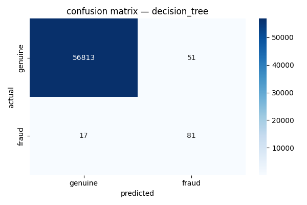
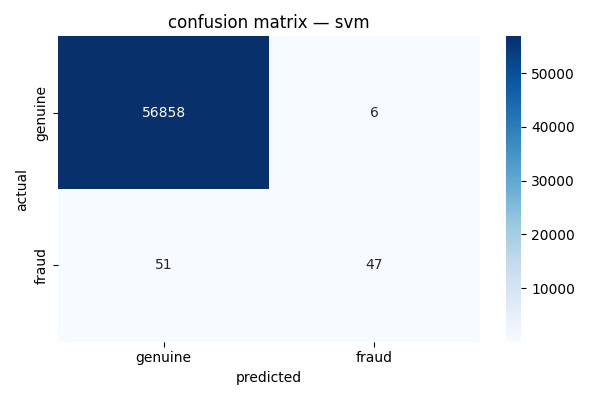
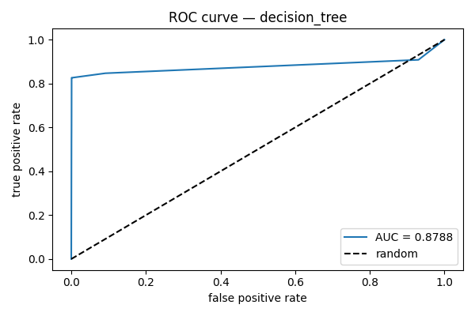
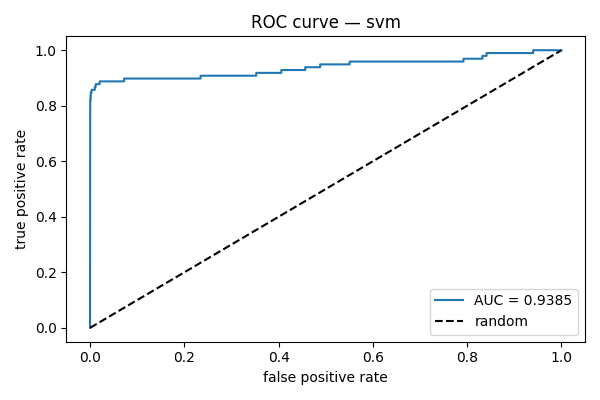

# insurance-fraud-detection

I built this to go beyond the usual "train a model and check accuracy" approach. It handles class imbalance, compares two classifiers with a clear business reason behind the final pick, and serves predictions through a REST API.

Built with Python, scikit-learn, and FastAPI.

---

## what this does

Takes raw credit card transaction data, trains a Decision Tree and an SVM, evaluates them against metrics that actually matter for fraud, and exposes predictions through an API.

The models aren't the hard part — the decisions around data and evaluation are.

---

## the problem with this dataset

284,807 transactions. Only 492 are fraud. That's **0.17%**.

A model that predicts "genuine" every single time gets 99.83% accuracy and catches zero fraud. Accuracy is useless here. That's the class imbalance problem, and it's the first thing I fixed.

**Solution:** SMOTE (Synthetic Minority Oversampling Technique) generates synthetic fraud examples during training so the model actually learns what fraud looks like.

```
before SMOTE   →   394 fraud cases out of 227,845
after SMOTE    →   227,451 fraud cases out of 454,902
```

SMOTE is only applied to training data — never to the test set. Applying it to test data leaks information and inflates your numbers.

---

## results

| model | precision | recall | f1 | AUC |
|---|---|---|---|---|
| Decision Tree | 0.61 | 0.83 | 0.70 | 0.88 |
| SVM | 0.89 | 0.48 | 0.62 | 0.94 |

**which model wins?** depends on what you care about.

- **precision** — of everything flagged as fraud, how much was actually fraud
- **recall** — of all actual fraud, how much did we catch

For a bank, missing real fraud (low recall) is more costly than a false alarm (low precision). Decision Tree catches 83% of fraud. SVM only catches 48%.

Decision Tree is the better choice for this use case — even though SVM has a higher AUC.

### confusion matrices

| Decision Tree | SVM |
|---|---|
|  |  |

### ROC curves

| Decision Tree | SVM |
|---|---|
|  |  |

---

## why SVM takes forever (and how I fixed it)

SVM scales at O(n²). Training on 454k rows took **53 minutes** on an M1 Pro.

I capped training data at 50k rows after SMOTE. Training time dropped to under 30 seconds with no meaningful drop in performance. Not a shortcut — a real tradeoff you'd make in production too.

It's in `configs/config.yaml` so it's easy to change:

```yaml
data:
  train_cap: 50000
```

---

## project structure

```
insurance-fraud-detection/
├── pipeline/
│   ├── data/
│   │   ├── load_data.py       # loads and validates raw CSV
│   │   └── preprocess.py      # scaling, train/test split, SMOTE, cap
│   └── models/
│       ├── train.py           # trains Decision Tree and SVM, saves .pkl
│       └── evaluate.py        # confusion matrix, ROC curves, summary table
├── configs/
│   └── config.yaml            # hyperparams, paths, all tunable settings
├── assets/                    # confusion matrix and ROC curve plots
├── app.py                     # FastAPI REST API
├── main.py                    # runs the full pipeline end to end
└── requirements.txt
```

---

## quickstart

```bash
git clone https://github.com/mhd-faizzan/insurance-fraud-detection
cd insurance-fraud-detection

uv venv && source .venv/bin/activate
uv add -r requirements.txt
```

download the dataset from [Kaggle](https://www.kaggle.com/datasets/mlg-ulb/creditcardfraud) and place it at:

```
data/raw/creditcard.csv
```

run the full pipeline:

```bash
python main.py
```

this loads the data, preprocesses it, trains both models, evaluates them, and saves plots to `assets/`.

---

## API

start the server:

```bash
uvicorn app:app --reload
```

**endpoints**

```
GET  /health                   model status check
POST /predict/decision-tree    predict using Decision Tree
POST /predict/svm              predict using SVM
```

interactive docs at `http://127.0.0.1:8000/docs`

**example — known fraud transaction from the dataset**

```bash
curl -X POST http://127.0.0.1:8000/predict/decision-tree \
  -H "Content-Type: application/json" \
  -d '{
    "V1": -2.3122, "V2": 1.9519, "V3": -1.6098, "V4": 3.9979,
    "V5": -0.5220, "V6": -1.4265, "V7": -2.5374, "V8": 0.8177,
    "V9": -0.8229, "V10": -2.7571, "V11": 3.2024, "V12": -2.8992,
    "V13": -0.5952, "V14": -4.2895, "V15": 0.3898, "V16": -1.1407,
    "V17": -2.8305, "V18": -0.0168, "V19": 0.4165, "V20": 0.1260,
    "V21": 0.5177, "V22": -0.0355, "V23": -0.4654, "V24": 0.3799,
    "V25": 0.1358, "V26": -0.1453, "V27": 0.0635, "V28": 0.0324,
    "Amount": 149.62
  }'
```

```json
{
  "model": "decision_tree",
  "prediction": "fraud",
  "probability": 0.87
}
```

note: SVM returns "genuine" for this transaction — that's a false negative, and exactly why recall matters more than precision for fraud detection.

---

## dataset

[Credit Card Fraud Detection](https://www.kaggle.com/datasets/mlg-ulb/creditcardfraud) — ULB Machine Learning Group

284,807 transactions from European cardholders. Features V1–V28 are PCA-transformed to protect cardholder privacy. Only `Amount` and `Time` are in their original form. `Time` is dropped during preprocessing as it adds no predictive value.

---

## findings

SVM has a higher AUC (0.94 vs 0.88) — better at ranking transactions by risk in theory. But a recall of 0.48 means it misses more than half of actual fraud. That's a dealbreaker for a fraud detector.

My take: Decision Tree for initial flagging, SVM as a secondary filter on already-flagged transactions. High recall on the first pass, high precision on the second. That's how I'd wire this in production.